# Swarnakar · স্বর্ণকার

### A Bengali-first jewellery market and business toolkit built with Flutter and Firebase

Swarnakar is a feature-oriented Flutter application designed for Bangladesh's jewellery ecosystem. It brings market prices, trade calculations, weight conversion, zakat estimation, account management, and subscription-aware experiences into one Bengali-first interface.

The project demonstrates practical Flutter architecture, reactive Firestore streams, Riverpod state management, responsive UI, connectivity handling, Bengali localization, and cross-platform integration.

> **Project maturity:** tested portfolio prototype. Authentication, responsive web deployment, Firestore rules, and the main calculation journeys are implemented. Subscription activation is intentionally simulated and no real payment is collected.

## Live demo

**[Open Swarnakar on Firebase Hosting](https://swarnakar-59dd6.web.app/#/login)**

The deployed app is intended for portfolio demonstration. Market values depend on the `prices/current` Firestore document and must not be treated as financial advice.

## Preview

## Quick navigation

- [Product overview](#product-overview)
- [Feature map](#feature-map)
- [Technology stack](#technology-stack)
- [System architecture](#system-architecture)
- [Runtime data flow](#runtime-data-flow)
- [Project structure](#project-structure)
- [Navigation map](#navigation-map)
- [Database design](#database-design)
- [Authentication lifecycle](#authentication-lifecycle)
- [State management](#state-management)
- [Setup](#setup)
- [Running and building](#running-and-building)
- [Engineering decisions](#engineering-decisions)
- [Project health](#project-health)
- [Security review](#security-review)
- [Roadmap](#roadmap)
- [Troubleshooting](#troubleshooting)

---

## Product overview

Swarnakar addresses common day-to-day needs of jewellers and customers:

- Follow current gold and silver market rates.
- Compare new, old, fine, broken, and acid-based metal values.
- Calculate jewellery cost with labour.
- Convert grams, bhori, and troy ounces.
- Estimate zakat eligibility and payable amount.
- View an external historical price chart.
- Maintain a Bengali user profile and local session.
- Present premium features through a subscription-aware interface.

The experience uses a dark navy and gold visual language intended to evoke premium jewellery branding while remaining readable on mobile devices.

## Feature map

| Domain | Capabilities | Data source | Current maturity |
| --- | --- | --- | --- |
| Dashboard | Price summaries, notice, last update, shortcuts | Firestore streams | Implemented |
| Gold market | New, old, fine, and broken gold groups | prices/current | Implemented |
| Silver market | New silver, chandi, and acid values | prices/current | Implemented |
| Calculator | Metal value, labour, total | Local Riverpod state | Prototype |
| Converter | Gram, bhori, ounce conversion | Local formulas | Implemented |
| Zakat | Assets, debts, nisab, 2.5% result | Firestore plus fallbacks | Prototype |
| Price history | Goldr chart in embedded HTML | Third-party scripts | Partial |
| Reports | Category filters and report cards | Bundled mock records | Prototype |
| Accounts | Signup, login, profile, password reset | Custom Firestore accounts | Prototype |
| Subscription | Plans, gated UI, guest option | Local/Profile state | Clearly labelled demo only |
| Connectivity | Offline detection and recovery | Network plus DNS lookup | Implemented |

## Technology stack

| Layer | Technology | Responsibility |
| --- | --- | --- |
| Presentation | Flutter Material | Screens, responsive layouts, reusable widgets |
| Language | Dart | Application and domain logic |
| State | Flutter Riverpod | Local, asynchronous, and derived state |
| Navigation | GoRouter | Declarative routes and transitions |
| Backend data | Cloud Firestore | Prices, nisab values, profiles |
| Bootstrap | Firebase Core | Platform-specific Firebase initialization |
| Credentials | BCrypt | Prototype client-side password hashing |
| Persistence | Shared Preferences | Session and pending-signup state |
| Connectivity | connectivity_plus | Interface changes and online checks |
| Localization | intl | Bengali number/date formatting support |
| Web content | webview_flutter | Historical chart embedding |
| UI tooling | Google Fonts, SVG, Shimmer, Animate Do | Typography and presentation |
| Backend scaffold | Firebase Functions and TypeScript | Planned trusted server operations |

Package metadata requires Dart 3.x. The latest verified local environment used Flutter 3.44.6 and Dart 3.12.2.

---

## System architecture

~~~mermaid
%%{init: {"theme":"base","flowchart":{"curve":"basis","nodeSpacing":55,"rankSpacing":70},"themeVariables":{"background":"#0D1117","fontSize":"20px","fontFamily":"Arial","textColor":"#F8FAFC","primaryTextColor":"#F8FAFC","secondaryTextColor":"#F8FAFC","tertiaryTextColor":"#F8FAFC","lineColor":"#94A3B8","edgeLabelBackground":"#111827","clusterBkg":"#0F172A","clusterBorder":"#475569","clusterTextColor":"#F8FAFC"}}}%%
flowchart TB
    User([User]) --> UI

    subgraph Client["Flutter client"]
        UI["Presentation layer Screens and shared widgets"]
        Router["GoRouter Navigation and transitions"]
        State["Riverpod State and derived providers"]
        Services["Service layer Auth and connectivity"]
        Models["Domain models User, Price, Report"]
        Local["Local persistence Shared Preferences"]

        UI --> Router
        UI --> State
        State --> Services
        State --> Models
        Services --> Local
    end

    subgraph Firebase["Firebase"]
        Firestore[("Cloud Firestore")]
        Config["FlutterFire configuration"]
        Functions["Cloud Functions planned / incomplete"]
    end

    subgraph External["External services"]
        Goldr["Goldr widget"]
        CDN["jsDelivr / ApexCharts"]
        DNS["Internet reachability probe"]
    end

    Services --> Firestore
    State --> Firestore
    Config --> Client
    UI --> Goldr
    Goldr --> CDN
    Services --> DNS
    Functions -. future trusted operations .-> Firestore

    classDef active fill:#172554,stroke:#60A5FA,color:#FFFFFF,stroke-width:3px;
    classDef backend fill:#78350F,stroke:#FB923C,color:#FFFFFF,stroke-width:3px;
    classDef external fill:#14532D,stroke:#4ADE80,color:#FFFFFF,stroke-width:3px;
    classDef planned fill:#4C1D5F,stroke:#C084FC,color:#FFFFFF,stroke-width:3px,stroke-dasharray:7 5;
    class UI,Router,State,Services,Models,Local active;
    class Firestore,Config backend;
    class Goldr,CDN,DNS external;
    class Functions planned;
~~~

### Architectural boundaries

- **Presentation** owns rendering, input, navigation triggers, and responsive behavior.
- **Providers** expose reactive state and transform raw Firestore snapshots.
- **Services** contain connectivity and custom account operations.
- **Models** provide typed shapes for users, prices, and reports.
- **Firestore** is currently both the live data store and prototype account database.
- **Cloud Functions** is declared but not yet implemented.

## Runtime data flow

~~~mermaid
%%{init: {"theme":"base","sequence":{"diagramMarginX":45,"diagramMarginY":25,"actorMargin":75,"messageMargin":48,"noteMargin":18},"themeVariables":{"background":"#0D1117","fontSize":"20px","fontFamily":"Arial","textColor":"#F8FAFC","primaryTextColor":"#F8FAFC","secondaryTextColor":"#F8FAFC","tertiaryTextColor":"#F8FAFC","lineColor":"#94A3B8","actorBkg":"#172554","actorBorder":"#60A5FA","actorTextColor":"#FFFFFF","actorLineColor":"#60A5FA","signalColor":"#CBD5E1","signalTextColor":"#F8FAFC","labelBoxBkgColor":"#4C1D5F","labelBoxBorderColor":"#C084FC","labelTextColor":"#FFFFFF","loopTextColor":"#FFFFFF","noteBkgColor":"#164E63","noteBorderColor":"#22D3EE","noteTextColor":"#FFFFFF","activationBkgColor":"#14532D","activationBorderColor":"#4ADE80","sequenceNumberColor":"#FFFFFF"}}}%%
sequenceDiagram
    autonumber
    actor User
    participant Screen as Flutter screen
    participant Provider as Riverpod provider
    participant Network as Connectivity helper
    participant DB as Cloud Firestore

    rect rgb(13, 17, 23)
        Note over User,DB: Live market-price pipeline
        User->>Screen: Open market page
        Screen->>Provider: Watch AsyncValue
        Provider->>Network: Check internet
        Network-->>Provider: Connected
        Provider->>DB: Subscribe to prices/current
        DB-->>Provider: Snapshot stream
        Provider->>Provider: Parse and group
        Provider-->>Screen: Loading, data, or error
        Screen-->>User: Render Bengali UI
        DB-->>Provider: Price update
        Provider-->>Screen: Refresh UI
    end
~~~

This stream-based design avoids manual polling. Firestore changes flow through Riverpod and rebuild only listening widgets.

## Project structure

~~~text
.
├── android/                       Android Gradle project
├── assets/
│   ├── fonts/                     Reserved font assets
│   ├── images/                    Logos and raster artwork
│   ├── rive/                      Reserved animation assets
│   └── svg/                       SVG artwork
├── functions/                     Incomplete Functions scaffold
├── lib/
│   ├── core/
│   │   ├── constants/             Strings and asset paths
│   │   ├── providers/             Global, subscription, connectivity state
│   │   ├── router/                Application route table
│   │   ├── theme/                 Colors, text styles, app theme
│   │   └── utils/                 Formatting and connectivity helpers
│   ├── features/
│   │   ├── auth/                  Login, signup, OTP, password reset
│   │   ├── calculator/            Jewellery calculation
│   │   ├── converter/             Unit conversion
│   │   ├── dashboard/             Market overview
│   │   ├── gold_price/            Gold stream and UI
│   │   ├── price_history/         Native and web chart integration
│   │   ├── reports/               Filtering and mock report data
│   │   ├── settings/              Profile and password management
│   │   ├── silver_price/          Silver stream and UI
│   │   ├── splash/                Startup and session restoration
│   │   ├── subscription/          Paywall
│   │   └── zakat/                 Nisab stream and calculator
│   ├── shared/
│   │   ├── models/                Shared typed models
│   │   └── widgets/               Reusable design components
│   ├── app.dart                   MaterialApp.router
│   ├── firebase_options.dart      Generated FlutterFire options
│   └── main.dart                  Application entry point
├── web/                           Web shell, manifest, icons
├── firebase.json                  Firebase configuration
└── pubspec.yaml                   Dependencies and assets
~~~

## Navigation map

The route map is split into two compact diagrams so GitHub does not shrink one wide diagram into unreadable text.

### Authentication routes

~~~mermaid
%%{init: {"theme":"base","flowchart":{"curve":"basis","nodeSpacing":55,"rankSpacing":70},"themeVariables":{"background":"#0D1117","fontSize":"22px","fontFamily":"Arial","primaryTextColor":"#F8FAFC","secondaryTextColor":"#F8FAFC","tertiaryTextColor":"#F8FAFC","lineColor":"#94A3B8","edgeLabelBackground":"#111827","clusterBkg":"#0F172A","clusterBorder":"#475569","clusterTextColor":"#F8FAFC"}}}%%
flowchart TB
    Splash["START <b>/</b>"]
    Login["LOGIN <b>/login</b>"]
    Signup["SIGN UP <b>/signup</b>"]
    Forgot["RECOVERY <b>/forgot-password</b>"]
    OTP["VERIFY OTP <b>/otp</b>"]
    Reset["NEW PASSWORD <b>/reset-password</b>"]
    Home["DASHBOARD <b>/dashboard</b>"]

    Splash --> Login
    Splash --> Home
    Login --> Signup
    Login --> Forgot
    Signup --> OTP
    Forgot --> OTP
    OTP --> Reset
    OTP --> Home
    Login --> Home

    classDef start fill:#164E63,stroke:#22D3EE,color:#FFFFFF,stroke-width:3px;
    classDef auth fill:#4C1D5F,stroke:#C084FC,color:#FFFFFF,stroke-width:3px;
    classDef success fill:#14532D,stroke:#4ADE80,color:#FFFFFF,stroke-width:4px;
    class Splash start;
    class Login,Signup,Forgot,OTP,Reset auth;
    class Home success;
~~~

### Dashboard and feature routes

~~~mermaid
%%{init: {"theme":"base","flowchart":{"curve":"basis","nodeSpacing":55,"rankSpacing":70},"themeVariables":{"background":"#0D1117","fontSize":"22px","fontFamily":"Arial","primaryTextColor":"#F8FAFC","secondaryTextColor":"#F8FAFC","tertiaryTextColor":"#F8FAFC","lineColor":"#94A3B8","edgeLabelBackground":"#111827","clusterBkg":"#0F172A","clusterBorder":"#475569","clusterTextColor":"#F8FAFC"}}}%%
flowchart TB
    Home["DASHBOARD <b>/dashboard</b>"]

    subgraph Market["MARKET"]
        Gold["Gold prices <b>/gold-price</b>"]
        Silver["Silver prices <b>/silver-price</b>"]
        History["Price history <b>/price-history</b>"]
    end

    subgraph Tools["BUSINESS TOOLS"]
        Calc["Calculator <b>/calculator</b>"]
        Convert["Converter <b>/converter</b>"]
        Zakat["Zakat <b>/zakat</b>"]
    end

    subgraph Account["ACCOUNT"]
        Settings["Settings <b>/settings</b>"]
        Paywall["Demo plans <b>/paywall</b>"]
    end

    Home <--> Gold
    Home <--> Silver
    Home <--> History
    Home <--> Calc
    Home <--> Convert
    Home <--> Zakat
    Home <--> Settings
    Home <--> Paywall

    classDef home fill:#164E63,stroke:#22D3EE,color:#FFFFFF,stroke-width:4px;
    classDef market fill:#14532D,stroke:#4ADE80,color:#FFFFFF,stroke-width:3px;
    classDef tool fill:#172554,stroke:#60A5FA,color:#FFFFFF,stroke-width:3px;
    classDef account fill:#4C1D5F,stroke:#C084FC,color:#FFFFFF,stroke-width:3px;
    class Home home;
    class Gold,Silver,History market;
    class Calc,Convert,Zakat tool;
    class Settings,Paywall account;
~~~

All main feature routes use declarative GoRouter pages. Android also receives custom left/right edge gestures that return to the dashboard.

---

## Database design

Firestore is document-oriented. These conventional ER diagrams show the document entities, field types, primary/foreign keys, and ownership relationship without shrinking the text into one oversized image.

### Accounts and reports

### Market reference data

`uid` is the user document key. `reportId` is the planned report document key, while `userId` identifies its owner. Reports currently come from bundled mock data and are not persisted.

### Expected documents

#### prices/current

~~~json
{
  "gold_22k": 248000,
  "gold_21k": 236500,
  "gold_22k_old": 225000,
  "gold_21k_old": 214000,
  "gold_paka": 250000,
  "gold_tukra": 220000,
  "silver_22k": 4200,
  "silver_21k": 4000,
  "silver_chandi": 3600,
  "silver_acid_kaim": 3500,
  "updatedAt": "Firestore server timestamp",
  "notice": "আজকের বাজারদর আপডেট করা হয়েছে।"
}
~~~

Prices can be numbers or parseable numeric strings. Missing fields are omitted from the UI.

#### zakat/nisab

~~~json
{
  "gold_nisab": 895200,
  "silver_nisab": 52860
}
~~~

These are monetary thresholds. The same values are bundled as fallbacks and require periodic domain review.

#### users/{documentId}

The profile includes identity, business information, subscription metadata, password hash, temporary reset fields, and audit timestamps. Phone numbers are normalized and checked against the Bangladesh mobile pattern.

Firestore Security Rules are versioned in this repository and covered by 12 emulator authorization tests. They should still receive a production security review before handling real payments or sensitive customer data.

## Authentication lifecycle

Authentication currently combines Firebase Authentication for Google accounts with a prototype Firestore-based phone/password flow.

~~~mermaid
%%{init: {"theme":"base","sequence":{"diagramMarginX":45,"diagramMarginY":25,"actorMargin":75,"messageMargin":48,"noteMargin":18},"themeVariables":{"background":"#0D1117","fontSize":"20px","fontFamily":"Arial","textColor":"#F8FAFC","primaryTextColor":"#F8FAFC","secondaryTextColor":"#F8FAFC","tertiaryTextColor":"#F8FAFC","lineColor":"#94A3B8","actorBkg":"#172554","actorBorder":"#60A5FA","actorTextColor":"#FFFFFF","actorLineColor":"#60A5FA","signalColor":"#CBD5E1","signalTextColor":"#F8FAFC","labelBoxBkgColor":"#4C1D5F","labelBoxBorderColor":"#C084FC","labelTextColor":"#FFFFFF","loopTextColor":"#FFFFFF","noteBkgColor":"#164E63","noteBorderColor":"#22D3EE","noteTextColor":"#FFFFFF","activationBkgColor":"#14532D","activationBorderColor":"#4ADE80","sequenceNumberColor":"#FFFFFF"}}}%%
sequenceDiagram
    autonumber
    actor User
    participant UI as Auth screens
    participant Service as FirebaseAuthService
    participant Prefs as Shared Preferences
    participant DB as Firestore users

    rect rgb(15, 23, 42)
        Note over User,DB: Signup prototype
        User->>UI: Name, phone, password
        UI->>Service: Stage signup
        Service->>Prefs: Save pending signup
        User->>UI: Enter OTP
        UI->>Service: Complete signup
        Service->>Service: BCrypt password
        Service->>DB: Create user document
        Service->>Prefs: Save session phone
    end

    rect rgb(17, 24, 39)
        Note over User,DB: Login
        User->>UI: Phone and password
        UI->>Service: Sign in
        Service->>DB: Query user by phone
        DB-->>Service: User and password hash
        Service->>Service: BCrypt verification
        Service->>Prefs: Persist session phone
        Service-->>UI: User profile
    end

    rect rgb(30, 27, 75)
        Note over User,DB: App restart
        UI->>Service: Restore session
        Service->>Prefs: Read session phone
        Service->>DB: Reload profile
        Service-->>UI: Dashboard or login
    end
~~~

This diagram documents current behavior, not a recommended production pattern. See [Security review](#security-review).

## State management

~~~mermaid
%%{init: {"theme":"base","flowchart":{"curve":"basis","nodeSpacing":55,"rankSpacing":70},"themeVariables":{"background":"#0D1117","fontSize":"21px","fontFamily":"Arial","textColor":"#F8FAFC","primaryTextColor":"#F8FAFC","secondaryTextColor":"#F8FAFC","tertiaryTextColor":"#F8FAFC","lineColor":"#94A3B8","edgeLabelBackground":"#111827","clusterTextColor":"#F8FAFC"}}}%%
flowchart TB
    Firestore[("Firestore snapshots")] --> Streams["StreamProvider"]
    Connectivity["Connectivity stream"] --> Streams
    Services["Async services"] --> Futures["FutureProvider"]
    Inputs["User input"] --> State["StateProvider"]

    Streams --> Derived["Derived Provider"]
    Futures --> Derived
    State --> Derived

    Derived --> AsyncValue{"AsyncValue state"}
    AsyncValue --> Loading["Loading UI"]
    AsyncValue --> Data["Data UI"]
    AsyncValue --> Error["Offline / error UI"]

    State --> Calc["Calculator results"]
    State --> Filter["Report filters"]
    State --> Entitlement["Temporary entitlement"]

    classDef source fill:#78350F,stroke:#FB923C,color:#FFFFFF,stroke-width:3px;
    classDef provider fill:#172554,stroke:#60A5FA,color:#FFFFFF,stroke-width:3px;
    classDef decision fill:#4C1D5F,stroke:#C084FC,color:#FFFFFF,stroke-width:3px;
    classDef success fill:#14532D,stroke:#4ADE80,color:#FFFFFF,stroke-width:3px;
    classDef failure fill:#7F1D1D,stroke:#FB7185,color:#FFFFFF,stroke-width:3px;
    class Firestore,Connectivity,Services,Inputs source;
    class Streams,Futures,State,Derived provider;
    class AsyncValue decision;
    class Data,Calc,Filter,Entitlement success;
    class Loading provider;
    class Error failure;
~~~

This separation keeps stream parsing and UI state outside most widgets, while reusable components provide consistent presentation.

---

## Setup

### Prerequisites

- Flutter stable with Dart 3.x
- Android Studio or Android SDK
- Java 11-compatible Android tooling
- Chrome for web development
- Firebase project with Cloud Firestore
- FlutterFire CLI for reconfiguration
- Node.js 18 and npm for future Cloud Functions work

~~~bash
flutter doctor -v
flutter --version
dart --version
~~~

### Install dependencies

~~~bash
git clone https://github.com/Rihabz1/Swarnakar.git
cd Swarnakar
flutter pub get
flutter devices
~~~

The configured Android minimum SDK is 23.

### Configure Firebase

Generated files currently reference project swarnakar-59dd6. For a different environment:

1. Create/select a Firebase project.
2. Enable Cloud Firestore.
3. Register Android and/or web apps.
4. Run:

   ~~~bash
   flutterfire configure
   ~~~

5. Verify these generated/configured files:

   - lib/firebase_options.dart
   - android/app/google-services.json
   - firebase.json

6. Create prices/current and zakat/nisab.
7. Add, test, and deploy restrictive Firestore Security Rules.

Firebase client configuration identifies the project but is not the security boundary. Authentication and Security Rules must control access.

### Functions scaffold

~~~bash
cd functions
npm install
~~~

The manifest expects functions/lib/index.js, but source, TypeScript configuration, and compiled output are absent. A future implementation should add src/index.ts, tsconfig.json, linting, emulator coverage, and exported functions.

## Running and building

### Development

~~~bash
# Android
flutter run -d <android-device-id>

# Web
flutter run -d chrome
~~~

### Quality gates

~~~bash
dart format --output=none --set-exit-if-changed lib
flutter analyze
flutter test
~~~

Run the Firestore Security Rules suite against an isolated emulator:

~~~bash
cd firestore-tests
npm install
npm test
~~~

The test process starts and stops the Firestore emulator automatically. It
uses the local project ID swarnakar-test and never connects to production data.
Professional QA artifacts—including the strategy, traceability matrix, risk
register, defect template, and release checklist—live under docs/quality.

GitHub Actions runs formatting, analysis, 110 Flutter tests, coverage
enforcement, Android and web builds, and 12 emulator authorization tests.

### Artifacts

~~~bash
flutter build apk --debug
flutter build appbundle --release
flutter build web
~~~

Release Android signing must be configured before publishing. The Flutter web build and Firebase Hosting deployment are available through the live-demo link above.

Only Android and web Firebase options exist. Other platforms currently throw UnsupportedError.

## Engineering decisions

### Feature-oriented modules

Each business capability owns its presentation, providers, and optional data folder. This makes feature discovery straightforward and limits coupling.

### Reactive market data

Firestore snapshot streams update prices without manual refresh logic. Riverpod converts raw snapshots into typed and grouped UI state.

### Explicit connectivity states

The application distinguishes network-interface availability from usable internet access and presents purpose-built offline UI.

### Bengali-first experience

Core copy, formatting, and user feedback prioritize Bangladeshi users. Full ARB-based localization remains future work.

### Transparent prototype boundaries

Mock data, local entitlement toggles, incomplete backend code, and authentication limitations are documented instead of being represented as finished production systems.

## Project health

| Quality gate | Current result | Target |
| --- | --- | --- |
| Dependency resolution | Available | Reproducible in CI |
| Flutter analysis | Zero issues | Zero issues |
| Unit/widget tests | 110 passing | Critical paths covered |
| Flutter line coverage | 68.64% | Approximately 70% portfolio target |
| Integration tests | Missing | Emulator-backed flows |
| Android config | Present | Signed production bundle |
| Web build | Passing | Successful optimized build |
| Functions | Manifest only | Tested trusted backend |
| Reports | Mock records | Per-user persisted history |
| Payments | Explicitly labelled simulation | Verified provider integration if commercialized |
| Firestore rules | 12 emulator tests passing | Least-privilege tested rules |

The portfolio quality gate requires clean static analysis, passing Flutter and Firestore suites, and a successful optimized web build.

### Delivery maturity

~~~mermaid
%%{init: {"theme":"base","flowchart":{"curve":"basis","nodeSpacing":55,"rankSpacing":65},"themeVariables":{"background":"#0D1117","fontSize":"21px","fontFamily":"Arial","textColor":"#F8FAFC","primaryTextColor":"#F8FAFC","secondaryTextColor":"#F8FAFC","tertiaryTextColor":"#F8FAFC","lineColor":"#94A3B8","edgeLabelBackground":"#111827","clusterTextColor":"#F8FAFC"}}}%%
flowchart TB
    A["UI prototype complete"] --> B["Live market data partial"]
    B --> C["Quality and tests needed"]
    C --> D["Secure backend needed"]
    D --> E["Payments and entitlements needed"]
    E --> F["Production release target"]

    classDef done fill:#14532D,stroke:#4ADE80,color:#FFFFFF,stroke-width:3px;
    classDef partial fill:#78350F,stroke:#FB923C,color:#FFFFFF,stroke-width:3px;
    classDef todo fill:#172554,stroke:#60A5FA,color:#FFFFFF,stroke-width:3px;
    class A done;
    class B partial;
    class C,D,E,F todo;
~~~

## Security review

The following must be resolved before handling real customer credentials or payments:

1. Password hashes are stored in Firestore and verified on the client.
2. Signup currently accepts any non-empty OTP by default.
3. Reset OTP is returned to the client rather than delivered over verified SMS.
4. Pending signup temporarily stores a plain-text password in Shared Preferences.
5. A phone number acts as the session without a signed, expiring token.
6. Subscription can be enabled locally without payment verification.
7. Firestore rules are tested, but should receive another production review before launch.
8. Third-party JavaScript is executed for the historical chart.
9. Financial fallbacks can become stale.
10. Browser-level end-to-end authentication tests are not yet automated.

Recommended direction: adopt Firebase Authentication or another trusted identity provider, move privileged behavior to a backend, use short-lived verified tokens, enforce least-privilege rules, and validate payment entitlements server-side.

## Roadmap

~~~mermaid
%%{init: {"theme":"base","flowchart":{"curve":"basis","nodeSpacing":55,"rankSpacing":65},"themeVariables":{"background":"#0D1117","fontSize":"21px","fontFamily":"Arial","textColor":"#F8FAFC","primaryTextColor":"#F8FAFC","secondaryTextColor":"#F8FAFC","tertiaryTextColor":"#F8FAFC","lineColor":"#94A3B8","edgeLabelBackground":"#111827","clusterTextColor":"#F8FAFC"}}}%%
flowchart TB
    Foundation["1 · Foundation Repair web build Resolve analyzer findings Add CI and tests"]
    Security["2 · Security Trusted authentication SMS OTP controls Tested Firestore rules"]
    Product["3 · Product Persist reports Validate calculations Complete localization"]
    Commerce["4 · Commerce Payment provider Server receipt checks Expiring entitlements"]
    Release["5 · Release Android identity and signing Monitoring and privacy Staged production rollout"]

    Foundation --> Security --> Product --> Commerce --> Release

    classDef foundation fill:#172554,stroke:#60A5FA,color:#FFFFFF,stroke-width:3px;
    classDef security fill:#7F1D1D,stroke:#FB7185,color:#FFFFFF,stroke-width:3px;
    classDef product fill:#4C1D5F,stroke:#C084FC,color:#FFFFFF,stroke-width:3px;
    classDef commerce fill:#78350F,stroke:#FB923C,color:#FFFFFF,stroke-width:3px;
    classDef release fill:#14532D,stroke:#4ADE80,color:#FFFFFF,stroke-width:3px;
    class Foundation foundation;
    class Security security;
    class Product product;
    class Commerce commerce;
    class Release release;
~~~

### Prioritized checklist

- **P0:** secure authentication, Firestore rules, web build, release signing.
- **P1:** automated tests, CI, persistent reports, trusted subscription backend.
- **P2:** complete localization, monitoring, analytics, accessibility review.
- **P3:** iOS support, richer reporting, notifications, administrator tooling.

## Customization

| Concern | Location |
| --- | --- |
| Colors and theme | lib/core/theme |
| Bengali text | lib/core/constants/app_strings.dart |
| Asset paths | lib/core/constants/app_assets.dart |
| Logo and icons | assets/images |
| Routes | lib/core/router/app_router.dart |
| Firebase options | lib/firebase_options.dart |
| Version metadata | pubspec.yaml and AppStrings.appVersion |

Regenerate Android launcher icons:

~~~bash
dart run flutter_launcher_icons
~~~

Before publication, replace com.example.swarnakar, register the final ID with Firebase, configure a protected release keystore, and remove debug signing.

## Troubleshooting

### Markdown diagrams do not render

GitHub renders Mermaid fences natively. In VS Code, use a recent release or install a Markdown preview extension with Mermaid support. A basic renderer may show Mermaid as a code block rather than a diagram.

### Firebase initialization fails

Confirm the target is Android or web, rerun flutterfire configure, verify that the Android application ID matches google-services.json, and ensure Firestore is enabled.

### Market prices are empty

Verify internet access, the prices/current document, exact field names, numeric values, and Firestore read permissions.

### App remains offline

The connectivity helper performs a DNS lookup of google.com. A network that blocks this hostname can be misclassified. A project-controlled health endpoint is preferable.

### Web build fails at platformViewRegistry

Migrate price_history_web.dart away from the legacy dart:ui registration API and rerun flutter build web.

### Assets are missing

~~~bash
flutter clean
flutter pub get
~~~

Then confirm exact filename capitalization and pubspec asset declarations.

## Contributing

1. Create a focused branch.
2. Keep business logic outside presentation widgets where practical.
3. Format code and run all available quality checks.
4. Add tests for behavioral changes.
5. Document schema, rules, and configuration changes.
6. Never commit service accounts, keystores, passwords, secrets, or customer data.

Suggested commit style:

~~~text
feat: persist calculation reports
fix: update web platform view registration
test: cover zakat eligibility boundaries
docs: document Firebase emulator setup
~~~

## License

No license file is currently included. Unless the owner adds one, no permission is granted to copy, modify, or redistribute this source beyond applicable law.
